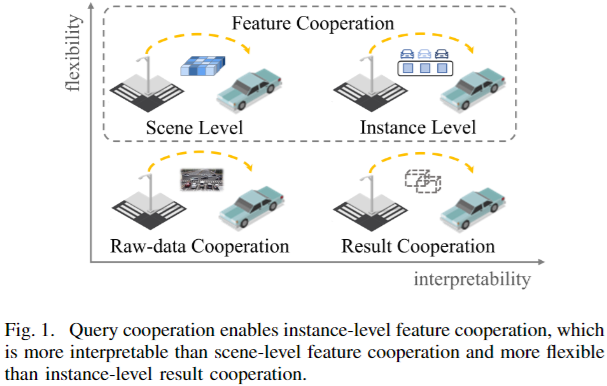
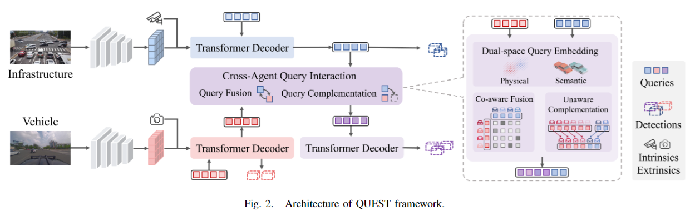

# QUEST: Query Stream for Practical Cooperative Perception



Aiming at interpretable and flexible cooperative perception, we propose the concept of query cooperation in this paper, which enables instance-level feature interaction among agents via the query stream. To specifically describe the query cooperation, a representative cooperative perception framework (QUEST) is proposed. It performs cross-agent query interaction by fusion and complementation, which are designed for co-aware objects and unaware objects respectively. Taking camera-based vehicle-infrastructure cooperative perception as a typical scenario, we generate the camera-centric cooperation labels of <em>DAIR-V2X-Seq</em> and evaluate the proposed framework on it. The experimental results not only demonstrate the effectiveness but also show the advantages of transmission flexibility and robustness to packet dropout. In addition, we discuss the pros and cons of query cooperation paradigm from the possible extensions and foreseeable limitations.



> For technical details, please refer to:
>
> [QUEST: Query Stream for Practical Cooperative Perception](https://arxiv.org/abs/2308.01804)

## Q&A

### Q1: Will the official code be open-sourced?

Really glad that our work is valuable for you. Actually, we are not planning to open-source the QUEST because of the requirement of the enterprise partners, but it is applied to a unified framework for **End-to-End Cooperative Autonomous Driving**, called UniV2X. 

The official code of UniV2X is open-sourced at [UniV2X-Github](https://github.com/AIR-THU/UniV2X), and your can find more implementation details of query cooperation in it.

For technical details of UniV2X, please refer to [UniV2X-Paper](https://arxiv.org/abs/2404.00717)

### Q2: How can I use the generated camera-centric cooperative labels of DAIR-V2X-Seq?
* Download the [camera-centric cooperative labels](https://drive.google.com/file/d/1J1yprm4M-24VhamQp-8mMjp39OyNUqBU/view?usp=sharing), and replace the original LiDAR-centric cooperative labels with it.
* Refer to [DAIR-V2X-Seq](https://github.com/AIR-THU/DAIR-V2X-Seq) for more details of the framework.

## Citation

If you find our work useful in your research, please consider citing:

```
@InProceedings{fan2023quest,
    author    = {Fan, Siqi and Yu, Haibao and Yang, Wenxian and Yuan, Jirui and Nie, Zaiqing},
    title     = {QUEST: Query Stream for Practical Cooperative Perception},
    booktitle = {IEEE International Conference on Robotics and Automation (ICRA)},
    month     = {May},
    year      = {2024},
    pages     = {}
}
```

## Our Related Resources

### Cooperative Autonomous Driving
* [Dataset CVPR2022] [DAIR-V2X](https://github.com/AIR-THU/DAIR-V2X): A Large-Scale Dataset for Vehicle-Infrastructure Cooperative 3D Object Detection
* [Dataset CVPR2023] [DAIR-V2X-Seq](https://github.com/AIR-THU/DAIR-V2X-Seq): A Large-Scale Sequential Dataset for Vehicle-Infrastructure Cooperative Perception and Forecasting
* [Method ICRA2024] [EMIFF](https://github.com/Bosszhe/EMIFF): Enhanced Multi-scale Image Feature Fusion for Vehicle-Infrastructure Cooperative 3D Object Detection
* [Method arxiv] [UniV2X](https://github.com/AIR-THU/UniV2X): End-to-End Autonomous Driving through V2X Cooperation

### Roadside Perception
* [Dataset CVPR2024] [RCooper](https://github.com/AIR-THU/DAIR-RCooper): A Real-world Large-scale Dataset for Roadside Cooperative Perception
* [Method IROS2023] [CBR](https://github.com/leofansq/CBR): Calibration-free BEV Representation for Infrastructure Perception

### Vehicle-side Perception
* [Method CVPR2021] [SCF-Net](https://github.com/leofansq/SCF-Net): Learning Spatial Contextual Features for Large-Scale Point Cloud Segmentation
* [Method TIP2023] [CPCL](https://github.com/leofansq/CPCL): Conservative-Progressive Collaborative Learning for Semi-supervised Semantic Segmentation
* [Method TVT2021] [FII-CenterNet](https://github.com/leofansq/FII-CenterNet): An Anchor-free Detector with Foreground Attention for Traffic Object Detection
* [Method arxiv] [SpiderMesh](https://github.com/leofansq/SpiderMesh): Spatial-aware Demand-guided Recursive Meshing for RGB-T Semantic Segmentation
